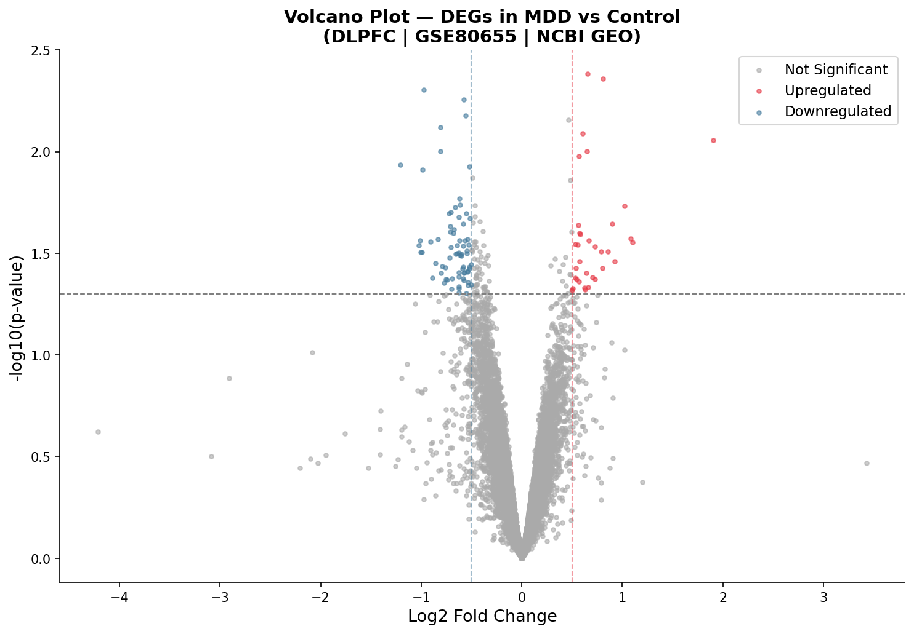
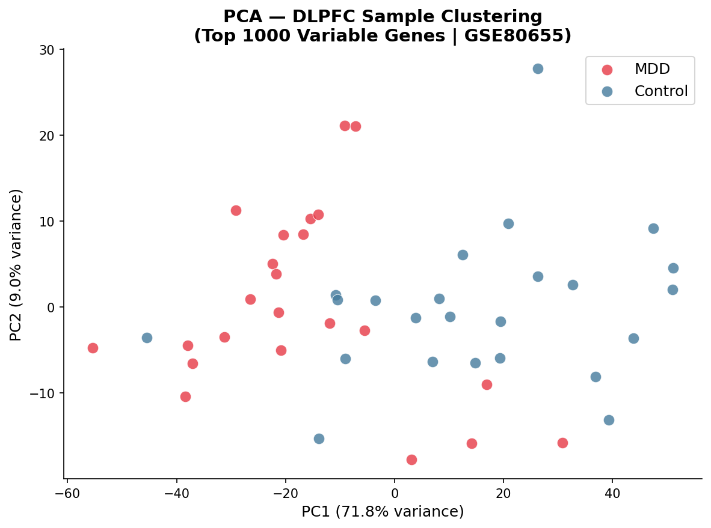
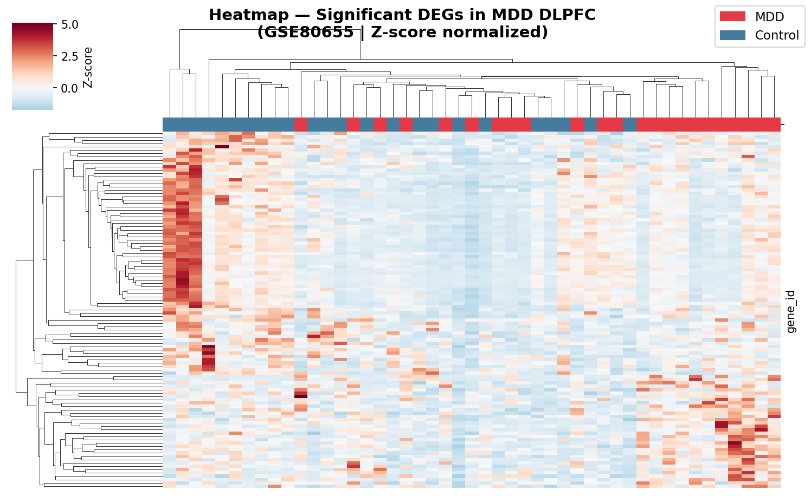
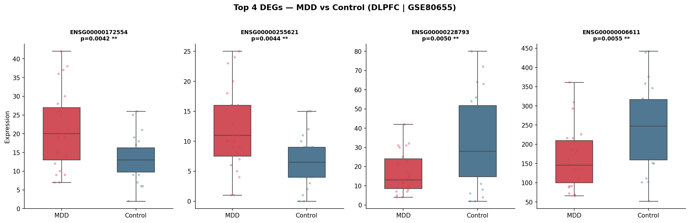
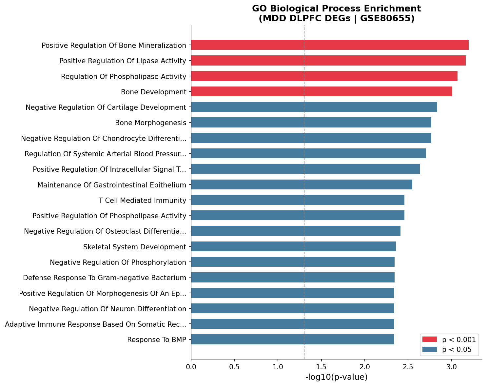
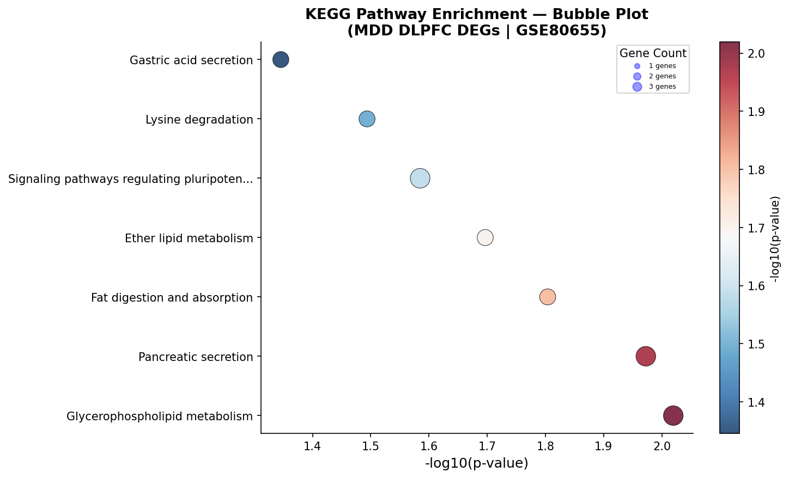
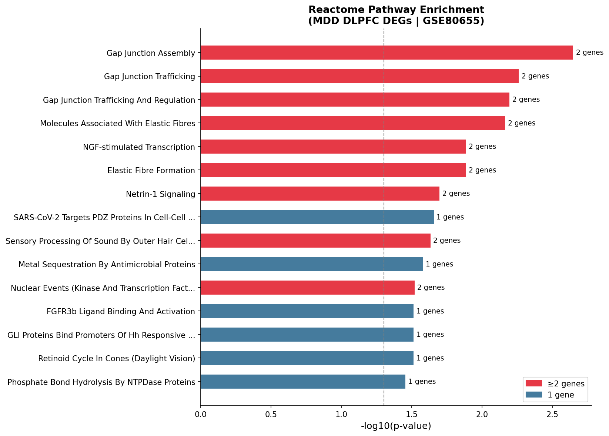

# 🧠 Differential Gene Expression Analysis in Major Depressive Disorder (MDD)


---

## 📌 Overview
This project performs a complete **Differential Gene Expression (DEG) analysis**
on post-mortem human brain RNA-seq data from patients with Major Depressive 
Disorder (MDD) vs healthy controls.

The data is sourced directly from **NCBI GEO** using Python — no manual 
downloading, no Excel. Everything is reproducible from a single Colab notebook.

---

## 🧬 Dataset
| Field | Details |
|---|---|
| **GEO Accession** | GSE80655 |
| **Title** | RNA-sequencing of human post-mortem brain tissues |
| **Brain Region** | Dorsolateral Prefrontal Cortex (DLPFC) |
| **MDD Samples** | 23 |
| **Control Samples** | 24 |
| **Total Genes** | 57,905 (22,766 after filtering) |
| **Species** | Homo sapiens |
| **Data Type** | RNA-seq raw counts |

---

## 🔬 Pipeline
```
NCBI GEO (GSE80655)
        ↓
Metadata Extraction (281 samples)
        ↓
Filter → DLPFC + MDD + Control (47 samples)
        ↓
Expression Matrix (57,905 genes × 47 samples)
        ↓
Quality Filtering (22,766 genes remaining)
        ↓
DEG Analysis (Welch's t-test per gene)
        ↓
FDR Correction (Benjamini-Hochberg)
        ↓
107 Significant DEGs identified
        ↓
Gene Name Conversion (ENSEMBL → Gene Symbols)
        ↓
GO Enrichment Analysis (222 significant processes)
        ↓
KEGG Pathway Analysis (7 significant pathways)
        ↓
Reactome Pathway Analysis (23 significant pathways)
        ↓
7 Publication-Quality Visualizations
```
---

## 📊 Results
| Category | Count |
|---|---|
| Total genes analyzed | 22,766 |
| Upregulated in MDD | 34 |
| Downregulated in MDD | 73 |
| Total significant DEGs | 107 |
| GO enriched processes | 222 |
| KEGG significant pathways | 7 |
| Reactome significant pathways | 23 |
```
### 🔝 Top Significant Genes
| Gene | Direction | p-value | Biological Role |
|---|---|---|---|
| SNTG2 | Upregulated | 0.0042 | Synaptic organization |
| NKG7 | Downregulated | 0.0076 | Immune/neuroinflammation |
| PRF1 | Downregulated | 0.0099 | Immune cell activity |
| SPX | Downregulated | 0.0171 | Stress neuropeptide |
| USH1C | Downregulated | 0.0055 | Neurological function |
```
---

## 📈 Visualizations

### 🌋 Volcano Plot

Shows all 22,766 genes — red = upregulated in MDD, blue = downregulated

### 🔵 PCA Plot

Sample clustering using top 1000 variable genes — PC1 explains 71.8% variance

### 🔥 Heatmap

Hierarchical clustering of 107 significant DEGs across all 47 samples

### 📦 Boxplots

Expression distribution of top 4 most significant genes

### 📊 GO Biological Process Enrichment


### 🫧 KEGG Pathway Bubble Plot


### 📊 Reactome Pathway Enrichment

```
---

### ⚙️ Tools & Libraries
| Library | Purpose |
|---|---|
| GEOparse | NCBI GEO data fetching |
| pandas | Data manipulation |
| numpy | Numerical operations |
| scipy | Welch's t-test |
| matplotlib | Plotting |
| seaborn | Statistical visualizations |
| sklearn | PCA and normalization |
| mygene | ENSEMBL ID to gene name conversion |
| gseapy | GO, KEGG and Reactome enrichment analysis |
```
---

## 🧠 Biological Interpretation
The DLPFC is the brain's emotion regulation center — reduced activity here
is a hallmark of MDD. Key findings:

- **Neuroinflammation** — immune genes (NKG7, PRF1) downregulated
- **Synaptic dysfunction** — synaptic genes (SNTG2) upregulated  
- **Stress response** — neuropeptide SPX downregulated
- **Mixed PCA signal** — consistent with MDD heterogeneity across patients

---

## 📚 References

### Dataset
1. Bowling et al. (2017). *Widespread sex differences in gene expression 
   and splicing in the adult human brain.* Nature Communications, 8, 14702.
   PMID: [28754123](https://pubmed.ncbi.nlm.nih.gov/28754123/)
   
2. NCBI GEO Dataset GSE80655:
   https://www.ncbi.nlm.nih.gov/geo/query/acc.cgi?acc=GSE80655

### Tools & Libraries
3. GEOparse — Python library for GEO data:
   https://github.com/guma44/GEOparse

4. GSEApy — Gene Set Enrichment Analysis in Python:
   https://gseapy.readthedocs.io/

5. MyGene.info — Gene annotation service:
   https://mygene.info/

### Databases
6. Gene Ontology Consortium (2023). *The Gene Ontology knowledgebase in 2023.*
   Genetics, 224(1).
   https://geneontology.org/

7. KEGG — Kyoto Encyclopedia of Genes and Genomes:
   Kanehisa M. et al. (2023). KEGG for taxonomy-based analysis of pathways 
   and genomes. Nucleic Acids Research, 51(D1), D587-D592.
   https://www.kegg.jp/

8. Reactome Pathway Database:
   Milacic M. et al. (2024). The Reactome Pathway Knowledgebase 2024.
   Nucleic Acids Research, 52(D1), D672-D678.
   https://reactome.org/

### Statistical Methods
9. Benjamini Y. & Hochberg Y. (1995). *Controlling the False Discovery Rate: 
   A Practical and Powerful Approach to Multiple Testing.*
   Journal of the Royal Statistical Society, 57(1), 289-300.

10. Welch B.L. (1947). *The generalization of Student's problem when several 
    different population variances are involved.*
    Biometrika, 34(1-2), 28-35.
---

## 👤 Author
**Sakshi Lodhi**  
Biotechnologist | Bioinformatics | Computational Neuroscience  
🔗 [LinkedIn](https://www.linkedin.com/in/sakshi-lodhi-rajput-4259a1240) | 🐙 [GitHub](https://github.com/YeahitsSakshi)
